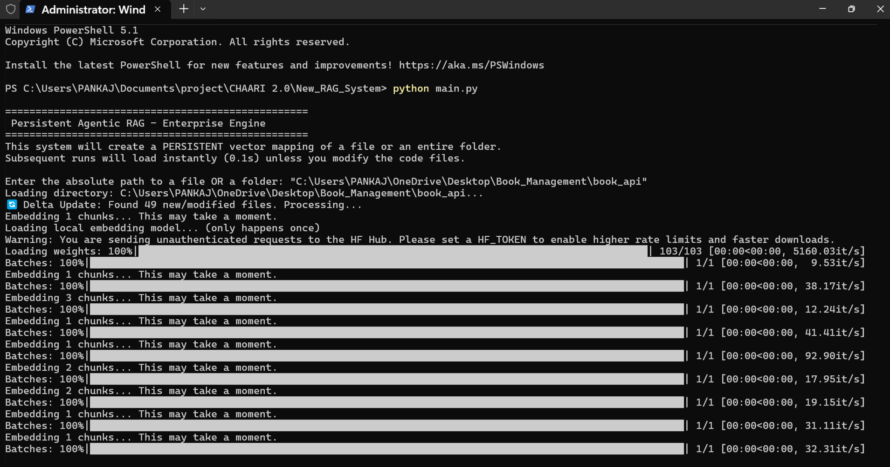
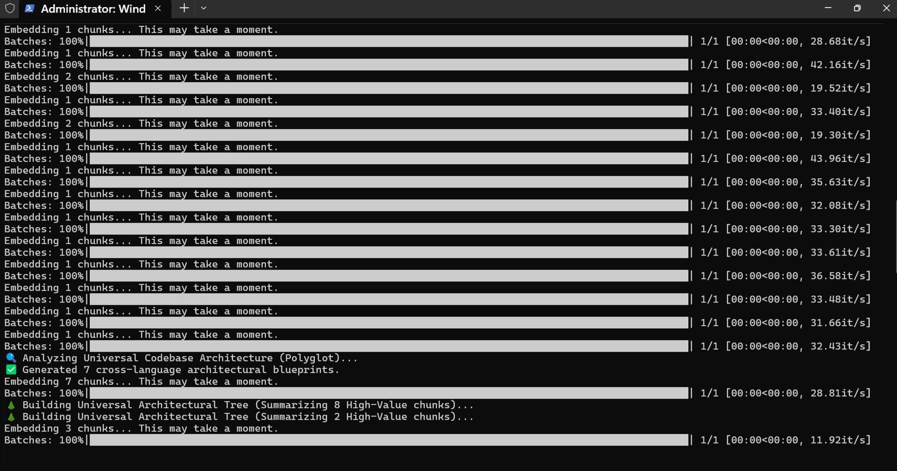
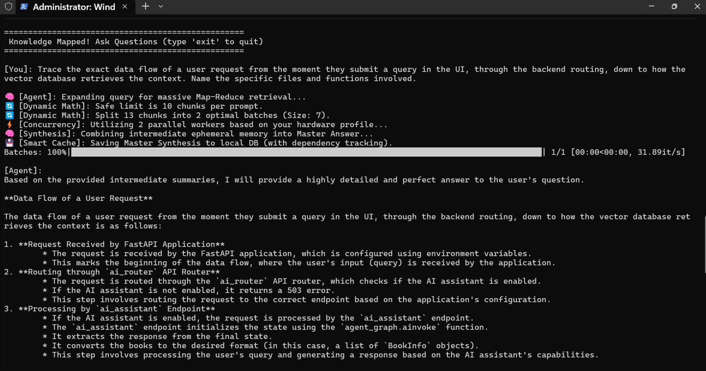

# 🧠 Agentic RAG System (Now Production-Ready)

A highly advanced, standalone Retrieval-Augmented Generation (RAG) engine designed for **deep document understanding** and **massive polyglot codebases**. 

**The Pitch:** Imagine having a brilliant, tireless assistant who instantly reads and memorizes every single file, document, and line of code in your entire company. Instead of spending days searching through massive folders to figure out how something works, you can simply ask a question in plain English and get an instant, perfectly accurate answer. That is the power of this Engine—a completely private, zero-cost artificial intelligence that securely runs directly on your laptop, learning your business inside and out without ever sending your data to the cloud.

* **The Polyglot Parser:** Seamlessly reads `.py`, `.js`, `.ts`, `.java`, `.pdf`, `.md`, `.json`, `.sql`, and more.
* **Microsoft Office Support:** Automatically converts `.docx`, `.pptx`, and `.xlsx` into clean markdown using Microsoft's open-source `MarkItDown` AI parser.

---

## 🔥 Ultimate New Features

### 1. Persistent State & Delta Updates (0-Second Load Times)
The days of waiting 5 minutes for the AI to re-read your codebase are over.
- **Persistent DB:** Vector embeddings are now saved permanently to your local disk.
- **Smart Hashing:** When you load a directory, it checks the exact modified timestamp of every file. It instantly loads the 199 files you didn't touch, and only re-embeds the 1 file you edited.

### 2. Hardware-Aware Concurrency
The system respects your specific laptop.
- **VRAM Profiler:** On first run, a native script physically pings your GPU to calculate exactly how much VRAM you have.
- **Dynamic Threads:** It sets a safe limit for parallel LLM calls (e.g., 4 streams for high-end GPUs, 2 for mid-tier, 1 for CPU) to guarantee Ollama never crashes.

### 3. Concurrent Map-Reduce Synthesis (Solving the Context Limit)
When a massive architecture question requires reading 20 files, feeding them into one prompt will crash the LLM. 
- **The Split:** The Agent slices the 20 files into smaller chunks.
- **The Concurrent Strike:** It processes those batches concurrently using your laptop's optimal thread count.
- **Master Synthesis:** It combines the intermediate summaries into one perfect, final Master Answer.

### 4. Dynamic Context-Safety Math
The system mathematically guarantees it will never overflow your LLM's context window.
- It calculates: `batch_size = min(Ideal_Speed_Batch, MAX_SAFE_CHUNKS)`
- If you upgrade your model to one with a 128k context window and update `config.py`, the math instantly adapts to allow massive batches, maximizing your speed.

### 5. Smart Cache Invalidation
When the Map-Reduce pipeline creates a massive "Master Answer", it saves it to the persistent database. Next time you ask, you get the answer instantly at a cost of **0 tokens**. 
- **Dependency Tracking:** It secretly tracks exactly which files were used to generate that Master Answer.
- **Auto-Wipe:** If you ever edit a bug in one of those files, the Delta Updater instantly hunts down and deletes the stale Master Answer cache, forcing the AI to read your updated code!

---

## 🚀 Setup & Installation

**1. Install Prerequisites**
You must have Python 3.10+ and Ollama installed. Make sure Ollama is running (`ollama serve`) and you have pulled the model (`ollama run llama3.2:3b`).

**2. Install Python Dependencies**
```bash
pip install pymupdf4llm rank_bm25 sentence-transformers numpy requests psutil
```

**3. Run the System**
```bash
python main.py
```
*Note: On your very first run, `hardware_monitor.py` will execute to profile your system's VRAM. This will only happen once!*

---

## 🛠️ Architecture Core

- **`rag_agent.py`:** The brains of the operation. Contains the Single-Pass Critic Loop and the new `map_reduce_ask()` concurrent synthesizer.
- **`vector_store.py`:** The local persistent database. Handles Delta Update logic and cache invalidation.
- **`config.py`:** Contains the Dynamic Context Math formula to protect your context limits.
- **`document_loader.py`:** Extracts pure Markdown from PDFs and intelligently chunks code files.
- **`tree_builder.py`:** (RAPTOR) Generates hierarchical summaries of individual files.
- **`hardware_monitor.py`:** The zero-dependency GPU VRAM profiler.

---

## 🧠 Why Build This?
This was engineered to be a standalone, cost-efficient, entirely local RAG system that runs on any developer's laptop. It proves that you don't need expensive cloud APIs to process massive codebases—you just need brilliant agentic engineering and strict mathematical resource management.

---

## 📸 In Action (Terminal Output)
Here is the Local Map-Reduce engine running in real-time on a massive codebase. Notice the dynamic batching math and hardware-aware concurrency limits protecting the Context Window:




### Complex Query Handling:


### To See More Questions and Answer Response check the folder [/Terminal_test_output]
